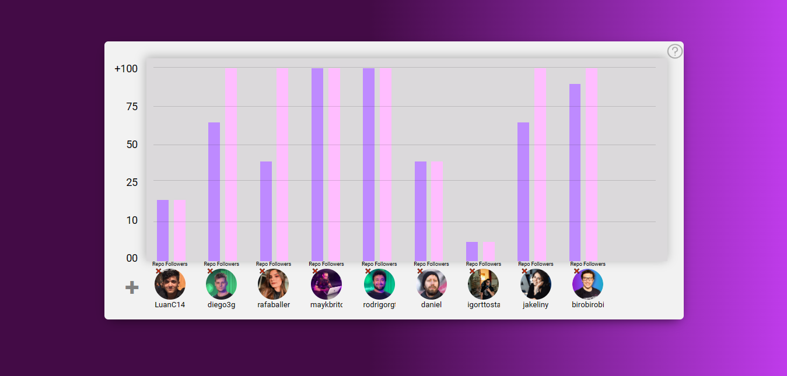

## Gráfico simples em barras, feito apenas com HTML e CSS e algumas interações com Javascript

- Consumido dados da API do Github via Fetch
- Programação orientada a objetos
- HTML, CSS e Javascript

> Nele você pode adicionar qualquer perfil do github e avaliar a partipação do usuário referente a quantidade de seguidores e de repositórios

